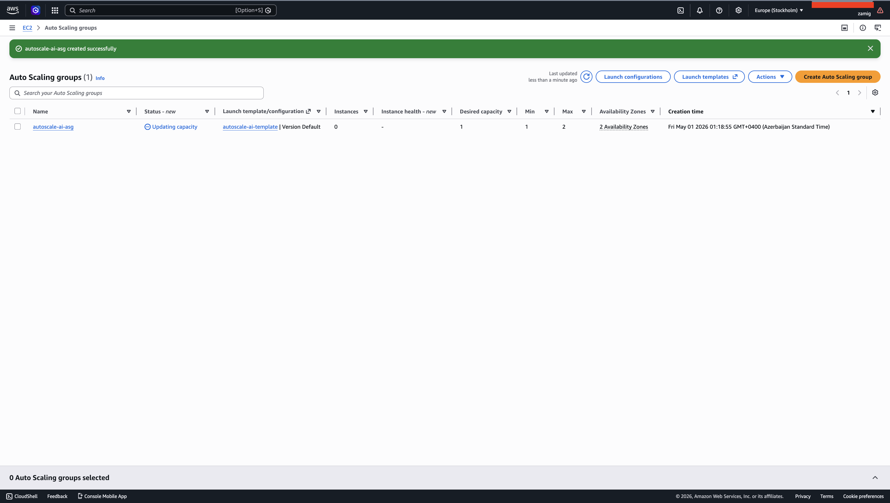
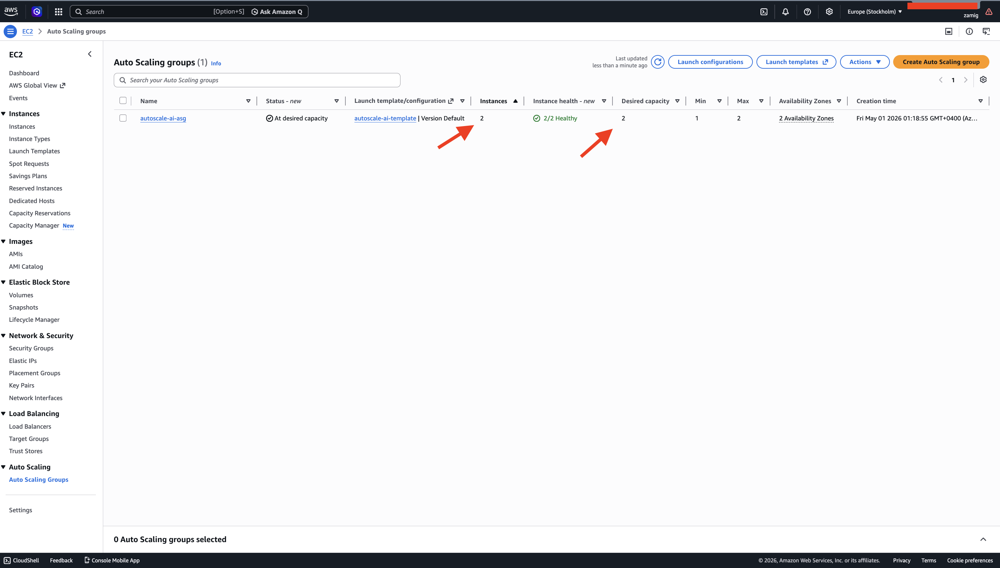
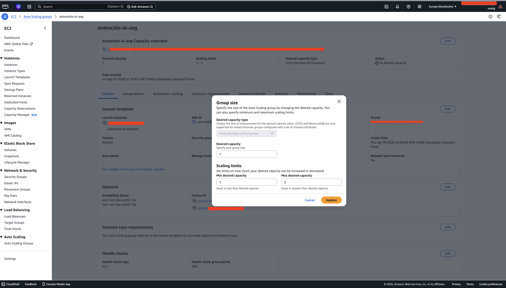
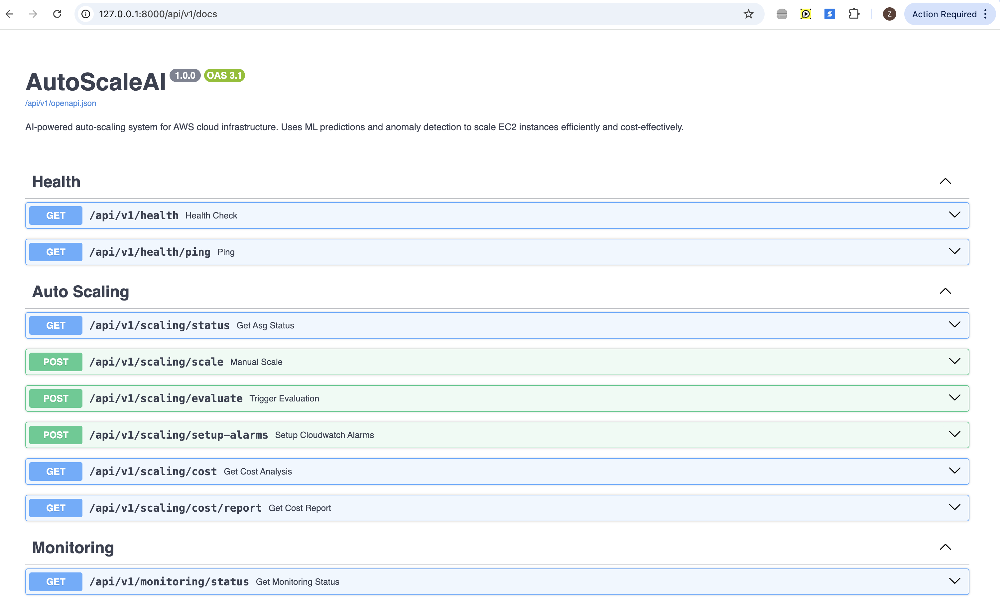

# aws-auto-scaling-ai
AI-powered auto scaling system on AWS that dynamically adjusts infrastructure based on real-time demand.

# 🚀 AI Auto Scaling System on AWS

> AI-powered auto scaling system that dynamically adjusts AWS infrastructure based on real-time demand.

---

## 📌 Overview

This project demonstrates an intelligent cloud system using **AWS Auto Scaling Groups (ASG)**.  
It automatically scales EC2 instances up/down based on workload.

---

## 🧠 Architecture

- EC2 (t3.micro)
- Auto Scaling Group
- Launch Template
- Multi Availability Zones
- FastAPI backend (Swagger UI)

---

## 📸 Proof of Work

### ☁️ Auto Scaling Group (Initial State - 1 Instance)

---

### 📈 Scaling in Action (2 Instances Running)

---

### ⚙️ Scaling Configuration (Min/Max Setup)

---

### 🌐 Backend API (Swagger UI)

---

## 💡 Key Concept

> **1 screenshot = 1 proof**

| Screenshot | Proof |
|----------|--------|
| Swagger UI | Backend is working |
| ASG Initial | Infrastructure created |
| 2 Instances | Scaling works |
| Scaling Config | Limits configured |

---

## ⚙️ How It Works

1. Launch Template defines instance config  
2. Auto Scaling Group manages EC2 instances  
3. Backend (FastAPI) triggers scaling logic  
4. System scales based on demand  

---

## 🔐 Security

Sensitive data has been hidden:
- Account ID
- Instance IDs
- Public IPs
- User information

---

## 📈 Result

- Fully working AWS Auto Scaling system  
- Real-time scaling demonstration  
- Production-ready foundation  

---

## 🚀 Future Improvements

- Add Application Load Balancer (ALB)
- CloudWatch-based auto scaling
- AI prediction improvements
- Terraform automation

---

## 👨‍💻 Author

** Zamig Aliyev **